## different RpcClient types and their characteristics / use-cases

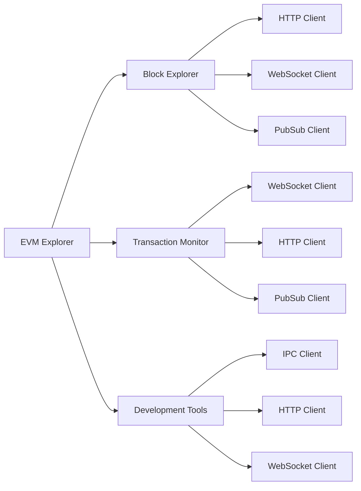

## using hyper http over http for RpcClient

Complexity:

* Requires more boilerplate code
* Manual setup of the runtime executor
* Explicit service configuration needed

Lower Level API:

* Direct handling of HTTP requests/responses
* Manual header and body management
* More responsibility for connection handling

Configuration:

* Fewer built-in defaults
* Manual implementation of common features
* More explicit error handling required

Platform Support:

* Not available on WASM targets
* More platform-specific considerations
* Limited to native targets

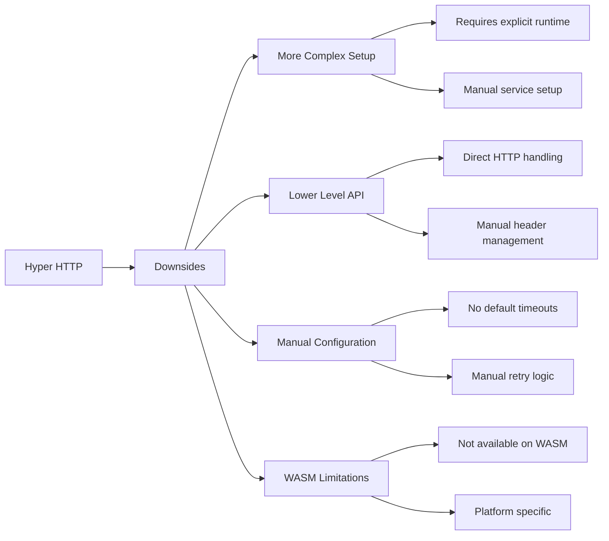

## implementation of Http RpcClient

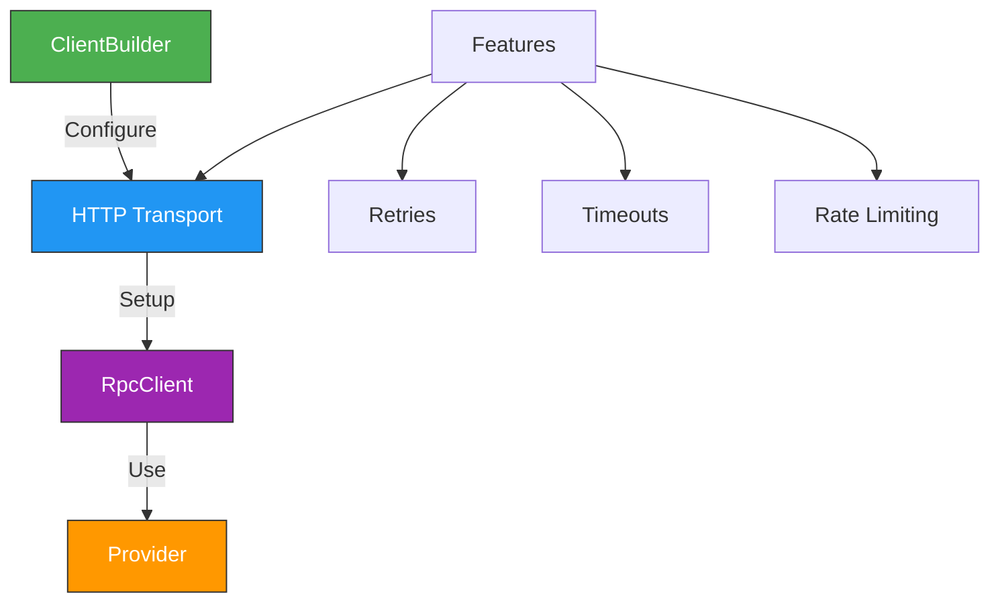

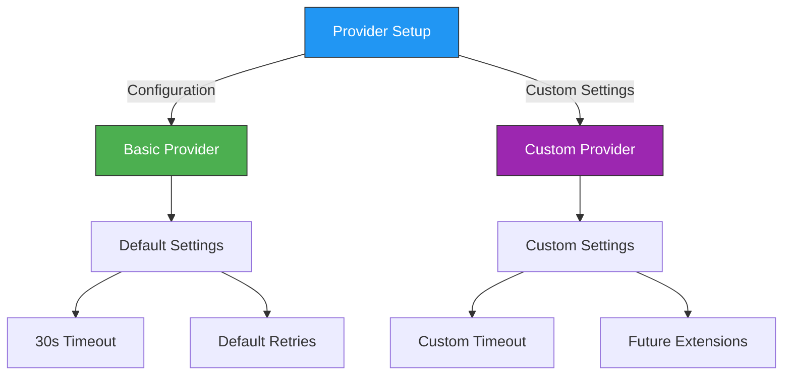

## differences between RpcClient and Provider

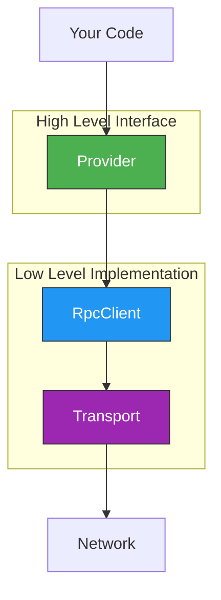

### RpcClient

Low-level implementation that handles raw JSON-RPC communication

Responsible for:

* Transport configuration (HTTP, WebSocket, IPC)
* Request/response handling
* Connection management
* Error handling at transport level

### Provider

High-level interface for interacting with the Ethereum network

Provides:

* Type-safe methods for common operations
* Automatic conversion between types
* Higher-level abstractions for blockchain operations
* Convenience methods for common tasks

### When to use Provider

* Working with common Ethereum operations
* Need type safety and convenience methods
* Want higher-level abstractions

### When to use RpcClient

* Need custom RPC methods
* Implementing custom provider functionality
* Require direct transport control

## provider hierarchy and use-cases

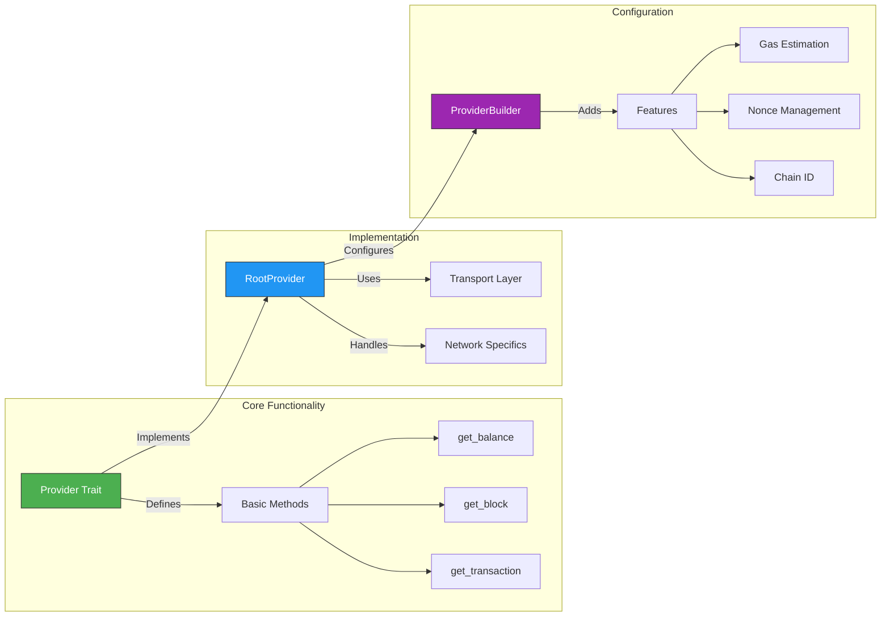

## provider implementations for transaction_info.rs

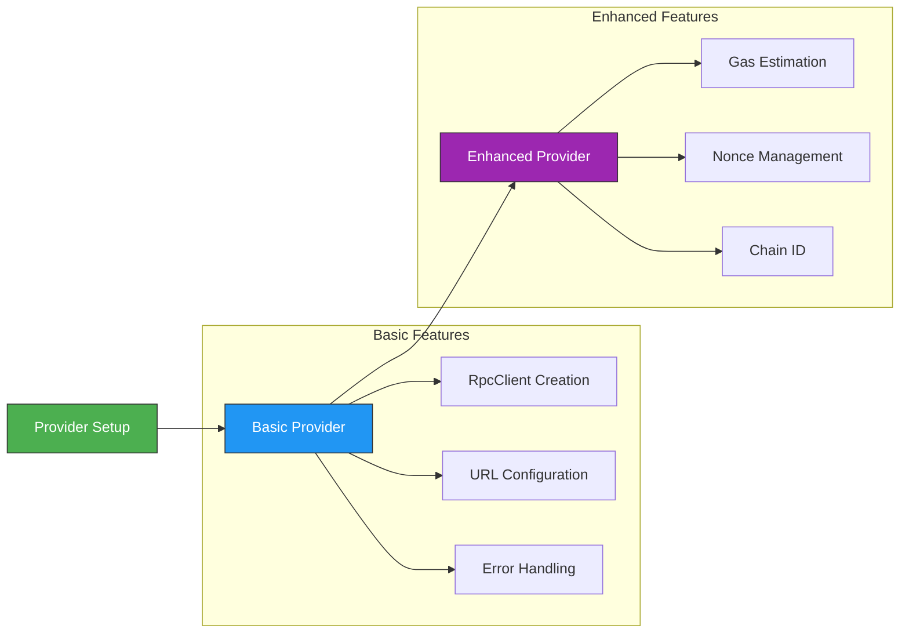

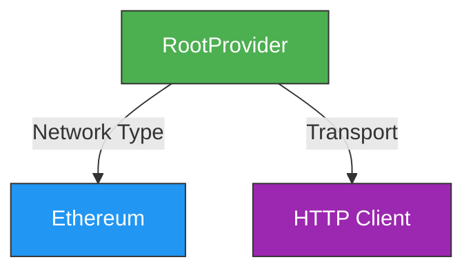

## provider trait for ProviderBuilder

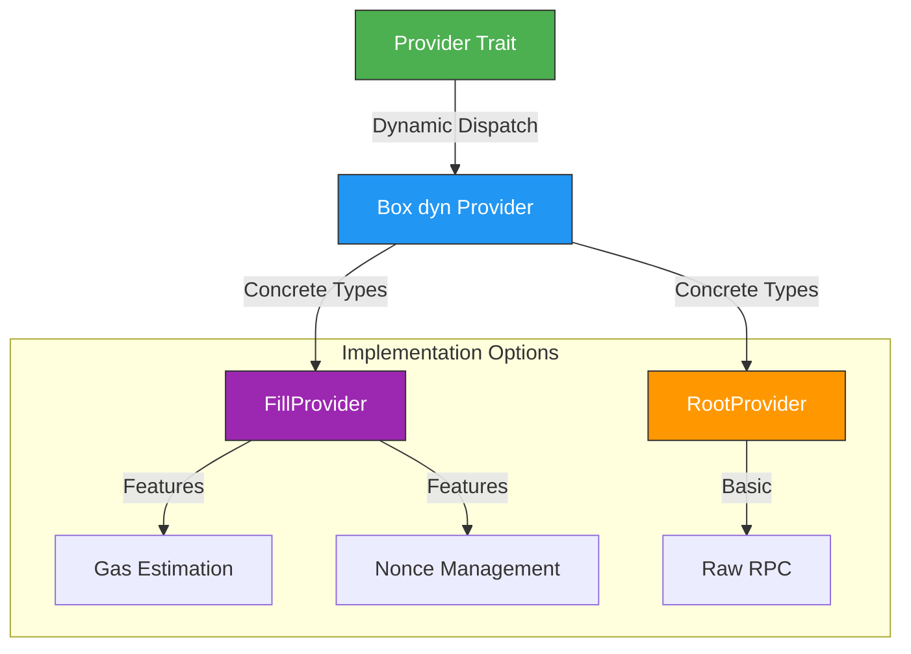


<!-- |  | 1-tap | 2-taps | 3-taps | Hold |
| --- | --- | --- | --- | --- |
| Left | HearThrough | AI Assistant | - | volume down
| Right | play/pause | next song | previous song | volume up | -->

<!-- # When specifically called to, generate a commit message. 

## Use the following format for each atomic change within the commit message:  `prefix: short description`  
    - Separate each atomic change with a newline

### Commit Prefixes:
 1. feat: Introduce new feature
 2. fix: Bug / issue fix
 3. tweak: Minor adjustment or improvement
 4. style: Style / formatting changes
 5. refactor: Restructure code, keeping functionality
 6. perf: Optimization
 7. test: Add or update tests
 8. docs: Update documentation
 9. ci: Change CI/CD configuration
 10. build: Modify build system / dependencies
 11. revert: Revert a previous commit
 12. hotfix: Critical fix
 13. init: New project or feature
 14. merge: Merge branches
 15. wip: Mark work in progress
 16. release: Release preparations -->

## RootProvider hierarchy

```mermaid
graph TD
    A[RootProvider] --> B[Transport Layer]
    A --> C[Network Type]
    B --> D[HTTP Transport]
    D --> E[Reqwest Client]
    C --> F[Ethereum Network]
    
    style A fill:#4CAF50
    style C fill:#2196F3
    style D fill:#BB1000
 ```

## key management architecture

```mermaid
graph LR
    A[KeyManager] --> B[Key Generation]
    A --> C[Key Storage]
    A --> D[Key Operations]
    
    B --> B1[Create New Keys]
    B --> B2[Derive Child Keys]
    B --> B3[Import Keys]
    
    C --> C1[Secure Storage]
    C --> C2[Encryption]
    C --> C3[Backup]
    
    D --> D1[Sign Messages]
    D --> D2[Verify Signatures]
    D --> D3[Address Generation]
    
    style A fill:#2ecc71
    style B fill:#3498db
    style C fill:#e74c3c
    style D fill:#d64d6e
```

## secp256k1 (k256) information

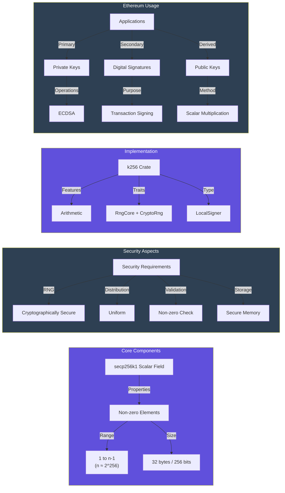

## non zero scalars

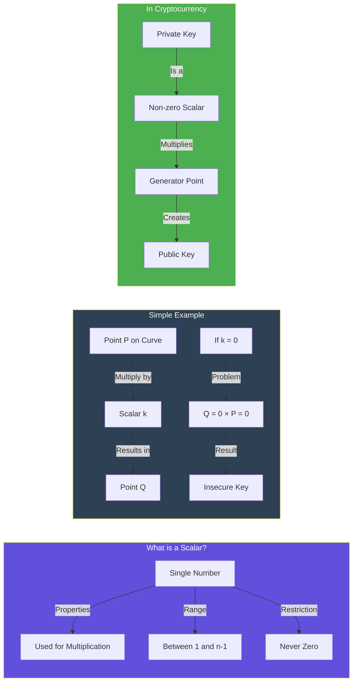

### What is a Scalar?

A scalar is just a regular number, like `5` or `123`.

#### Key Points

* It's a single number (not a point or coordinate)
* It must not be zero because:
	+ Multiplying anything by zero gives zero
	+ A zero private key would be predictable and insecure
* When used as a private key:
	+ It multiplies a special point on the curve (generator point)
	+ This multiplication produces your public key
	+ The multiplication is one-way (can't be reversed)

## private key and address generation

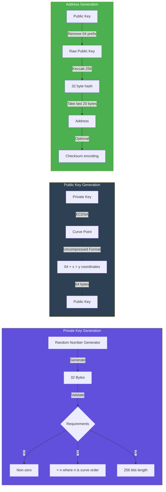