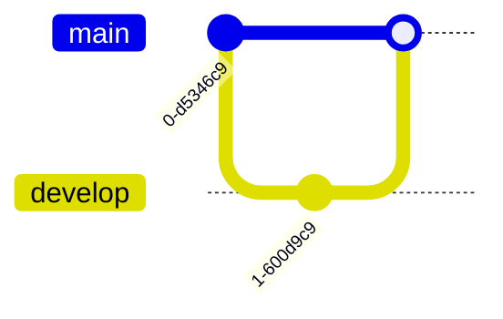

# different RpcClient types and their characteristics / use-cases


# using hyper http over http for RpcClient

Complexity:

* Requires more boilerplate code
* Manual setup of the runtime executor
* Explicit service configuration needed

Lower Level API:

* Direct handling of HTTP requests/responses
* Manual header and body management
* More responsibility for connection handling

Configuration:

* Fewer built-in defaults
* Manual implementation of common features
* More explicit error handling required

Platform Support:

* Not available on WASM targets
* More platform-specific considerations
* Limited to native targets


# implementation of Http RpcClient


# differences between RpcClient and Provider


## RpcClient

Low-level implementation that handles raw JSON-RPC communication

Responsible for:

* Transport configuration (HTTP, WebSocket, IPC)
* Request/response handling
* Connection management
* Error handling at transport level

## Provider

High-level interface for interacting with the Ethereum network

Provides:

* Type-safe methods for common operations
* Automatic conversion between types
* Higher-level abstractions for blockchain operations
* Convenience methods for common tasks

## When to use Provider

* Working with common Ethereum operations
* Need type safety and convenience methods
* Want higher-level abstractions

## When to use RpcClient

* Need custom RPC methods
* Implementing custom provider functionality
* Require direct transport control

# provider hierarchy and use-cases


# provider implementations for transaction_info.rs


# provider trait for ProviderBuilder


<!-- |  | 1-tap | 2-taps | 3-taps | Hold |
| --- | --- | --- | --- | --- |
| Left | HearThrough | AI Assistant | - | volume down
| Right | play/pause | next song | previous song | volume up | -->

<!-- # When specifically called to, generate a commit message. 

# Use the following format for each atomic change within the commit message:  `prefix: short description`  
    - Separate each atomic change with a newline

## Commit Prefixes:
 1. feat: Introduce new feature
 2. fix: Bug / issue fix
 3. tweak: Minor adjustment or improvement
 4. style: Style / formatting changes
 5. refactor: Restructure code, keeping functionality
 6. perf: Optimization
 7. test: Add or update tests
 8. docs: Update documentation
 9. ci: Change CI/CD configuration
 10. build: Modify build system / dependencies
 11. revert: Revert a previous commit
 12. hotfix: Critical fix
 13. init: New project or feature
 14. merge: Merge branches
 15. wip: Mark work in progress
 16. release: Release preparations -->

# RootProvider hierarchy

```mermaid
graph TD
    A[RootProvider] --> B[Transport Layer]
    A --> C[Network Type]
    B --> D[HTTP Transport]
    D --> E[Reqwest Client]
    C --> F[Ethereum Network]
    
    style A fill:#4CAF50
    style C fill:#2196F3
    style D fill:#BB1000
 ```

# key management architecture

```mermaid
graph LR
    A[KeyManager] --> B[Key Generation]
    A --> C[Key Storage]
    A --> D[Key Operations]
    
    B --> B1[Create New Keys]
    B --> B2[Derive Child Keys]
    B --> B3[Import Keys]
    
    C --> C1[Secure Storage]
    C --> C2[Encryption]
    C --> C3[Backup]
    
    D --> D1[Sign Messages]
    D --> D2[Verify Signatures]
    D --> D3[Address Generation]
    
    style A fill:#2ecc71
    style B fill:#3498db
    style C fill:#e74c3c
    style D fill:#d64d6e
```

# secp256k1 (k256) information

```mermaid
graph LR
    subgraph Core["Core Components"]
        A[secp256k1 Scalar Field] -->|Properties| B[Non-zero Elements]
        B -->|Range| C["1 to n-1<br/>(n ≈ 2^256)"]
        B -->|Size| D[32 bytes / 256 bits]
    end

    subgraph Security["Security Aspects"]
        E[Security Requirements] -->|RNG| F[Cryptographically Secure]
        E -->|Distribution| G[Uniform]
        E -->|Validation| H[Non-zero Check]
        E -->|Storage| I[Secure Memory]
    end

    subgraph Implementation["Implementation"]
        J[k256 Crate] -->|Features| K[Arithmetic]
        J -->|Traits| L[RngCore + CryptoRng]
        J -->|Type| M[LocalSigner<SigningKey>]
    end

    subgraph Usage["Ethereum Usage"]
        N[Applications] -->|Primary| O[Private Keys]
        N -->|Secondary| P[Digital Signatures]
        N -->|Derived| Q[Public Keys]
        
        O -->|Operations| R[ECDSA]
        P -->|Purpose| S[Transaction Signing]
        Q -->|Method| T[Scalar Multiplication]
    end

    style Core fill:#6050DC,color:#fff
    style Security fill:#2E4053,color:#fff
    style Implementation fill:#6050DC,color:#fff
    style Usage fill:#2E4053,color:#fff
```



# non zero scalars

```mermaid
graph LR
    subgraph Scalar["What is a Scalar?"]
        A[Single Number] -->|Properties| B[Used for Multiplication]
        A -->|Range| C["Between 1 and n-1"]
        A -->|Restriction| D[Never Zero]
    end

    subgraph Example["Simple Example"]
        E[Point P on Curve] -->|Multiply by| F[Scalar k]
        F -->|Results in| G[Point Q]
        H[If k = 0] -->|Problem| I[Q = 0 × P = 0]
        I -->|Result| J[Insecure Key]
    end

    subgraph Usage["In Cryptocurrency"]
        K[Private Key] -->|Is a| L[Non-zero Scalar]
        L -->|Multiplies| M[Generator Point]
        M -->|Creates| N[Public Key]
    end

    style Scalar fill:#6050DC,color:#fff
    style Example fill:#2E4053,color:#fff
    style Usage fill:#4CAF50,color:#fff
```



## What is a Scalar?

A scalar is just a regular number, like `5` or `123`.

### Key Points

* It's a single number (not a point or coordinate)
* It must not be zero because:
	+ Multiplying anything by zero gives zero
	+ A zero private key would be predictable and insecure
* When used as a private key:
	+ It multiplies a special point on the curve (generator point)
	+ This multiplication produces your public key
	+ The multiplication is one-way (can't be reversed)

# private key and address generation


# rust formatting traits with NonZeroScalars


## Display ({}) - For user-facing output

* Implements basic string representation
* Usually more concise
* What NonZeroScalar implements

## Debug ({:?} or {:#?}) - For debugging

* More detailed representation
* Not implemented for NonZeroScalar
* Would cause a compilation error

# mermaid graph types





```mermaid
gantt
  title Project Timeline
  section Phase 1
  Task 1: 2024-01-01, 30d
```

```mermaid
erDiagram
  WALLET ||--o{ TRANSACTION : has
  TRANSACTION {
    string hash
    uint value
  }
```

```mermaid
classDiagram
  class Wallet {
    +address: String
    +sign(tx: Transaction)
  }
```

```mermaid
stateDiagram-v2
  [*] --> Pending
  Pending --> Confirmed
  Pending --> Failed
```

```mermaid
sequenceDiagram
  Client->>Server: Request
  Server->>Client: Response
```

# PrivateKey and SigningKey differences

## **How `SigningKey` and `PrivateKey` Differ**  
At their core, **both `SigningKey` and `PrivateKey` represent an ECDSA private key**, but they serve different purposes and provide different abstractions. Below is a detailed yet simple breakdown of how `SigningKey` **abstracts** over the raw `PrivateKey`.  

---

## **1. `PrivateKey` - The Raw Private Key (Low-Level Representation)**
- `PrivateKey` **is just the raw 32-byte private key** used in Ethereum’s secp256k1 cryptography.  
- It is **just data**—a number between `1` and `2^256 - 1`, which represents the secret used to sign transactions.
- This means `PrivateKey` **does not inherently provide signing functionalities**—it simply holds the key.

🔹 **Think of `PrivateKey` like a bank account number**: it holds value, but by itself, it doesn’t perform actions.

### **Example of `PrivateKey` (Raw Storage)**
```rust
use alloy_primitives::B256;

fn main() {
    // A raw private key stored as 32 bytes
    let raw_private_key = B256::from([0x11; 32]); // Just 32 bytes of secret data

    println!("Raw Private Key: {:?}", raw_private_key);
}
```
---

## **2. `SigningKey` - An Abstraction Over `PrivateKey` (High-Level Representation)**
- `SigningKey` **wraps the private key and adds signing capabilities**.
- It internally **stores the private key** but also provides:
  - Secure key handling
  - Signature generation
  - Public key derivation  
- This means you can use `SigningKey` directly to sign messages, unlike `PrivateKey`, which is just raw data.

🔹 **Think of `SigningKey` like a bank debit card**: it represents the account (private key) but also lets you perform transactions (sign messages).

### **Example of `SigningKey` (High-Level Functionality)**
```rust
use k256::ecdsa::{SigningKey, Signature};
use rand::thread_rng;

fn main() {
    // Create a signing key (which contains the private key inside)
    let signing_key = SigningKey::random(&mut thread_rng());

    // Sign a message
    let message = b"Hello, Ethereum!";
    let signature: Signature = signing_key.sign(message);

    println!("Signature: {:?}", signature);
}
```
---

## **Key Differences Between `SigningKey` and `PrivateKey`**
| Feature        | `PrivateKey` (`alloy_primitives::B256`) | `SigningKey` (`k256::ecdsa::SigningKey`) |
|--------------|----------------------------------|----------------------------------|
| **Stores Private Key?** | ✅ Yes (just raw bytes) | ✅ Yes (wrapped inside) |
| **Can Sign Transactions?** | ❌ No (raw data only) | ✅ Yes (has signing methods) |
| **Can Derive Public Key?** | ❌ No (needs extra functions) | ✅ Yes (`signing_key.verifying_key()`) |
| **Security** | Needs explicit protection | Provides safer key handling |
| **Analogy** | 🔢 Bank account number | 💳 Bank debit card |

---

## **How `SigningKey` Abstracts Over `PrivateKey`**
1. **Encapsulation** – `SigningKey` **hides the private key inside itself**, preventing accidental exposure.
2. **Functionality** – Instead of manually handling raw bytes, `SigningKey` **provides built-in signing and verification**.
3. **Convenience** – With `SigningKey`, you don’t need to manually extract and format the private key—it **just works**.

---

## **Summary**
- **`PrivateKey`** is **just** a raw 32-byte secret key.  
- **`SigningKey`** is a **high-level wrapper** that includes the private key **plus** signing functionality.  
- If you just need to store a key, **use `PrivateKey`**.  
- If you need to sign transactions, **use `SigningKey`**.  

Would you like an example of securely storing and using `SigningKey` in an EVM-compatible wallet? 🚀

# representing B256 in different formats

```mermaid
graph TD
    A[B256] --> B[Raw Hex]
    A --> C[Prefixed Hex]
    A --> D[Checksum]
    
    B -->|to_string| E["64 chars<br/>e.g. 1234...abcd"]
    C -->|format!| F["66 chars<br/>e.g. 0x1234...abcd"]
    D -->|to_checksum| G["66 chars<br/>e.g. 0x1234...aBcD"]
    
    style A fill:#6050DC,color:#fff
    style B fill:#2E4053,color:#fff
    style C fill:#2E4053,color:#fff
    style D fill:#2E4053,color:#fff
```

# truncating 0x from printed B256

```mermaid
graph TD
    A[String Methods] --> B[Slicing]
    A --> C[strip_prefix]
    A --> D["chars().skip"]
    
    B -->|"&str[2..]"| E["✓ Zero-copy<br/>✓ No allocation<br/>✓ O(1) time"]
    C -->|".strip_prefix 0x"| F["✓ Safe<br/>× Returns Option<br/>× Pattern matching"]
    D -->|".chars().skip(2)"| G["× Iterator overhead<br/>× More complex<br/>× Less readable"]
    
    style A fill:#6050DC,color:#fff
    style B fill:#4CAF50,color:#fff
    style C fill:#2E4053,color:#fff
    style D fill:#2E4053,color:#fff
```
pri
# 0x prefix

```mermaid
graph LR
    A["0x Prefix"] --> B["Number Base Indicator"]
    A --> C["Protocol Standard"]
    A --> D["Data Format"]
    A --> E["Error Prevention"]
    
    B --> B1["Explicitly indicates<br/>hexadecimal representation"]
    C --> C1["Required by Ethereum<br/>JSON-RPC API"]
    D --> D1["Distinguishes hex strings<br/>from decimal strings"]
    E --> E1["Prevents misinterpretation<br/>of leading zeros"]
    
    style A fill:#6050DC,color:#fff
    style B fill:#2E4053,color:#fff
    style C fill:#2E4053,color:#fff
    style D fill:#2E4053,color:#fff
    style E fill:#2E4053,color:#fff
```

# display information for FixedBytes

```mermaid
graph TD
    A[Display Implementation] --> B[Full Hex Mode]
    A --> C[Compressed Mode<br/>if N > 4 or '#' flag]
    
    B --> B1["0x + full hex"]
    C --> C1["0x + first 2 bytes + ... + last 2 bytes"]
    
    B1 --> D["Example:<br/>0x1234567890abcdef"]
    C1 --> E["Example:<br/>0x1234...cdef"]
    
    style A fill:#6050DC,color:#fff
    style B fill:#2E4053,color:#fff
    style C fill:#2E4053,color:#fff
```

# differences between and considerations for SecretKey and SigningKey

### **Functional Differences Between `k256::ecdsa::SigningKey` and `k256::SecretKey`**  

Both **`SigningKey`** and **`SecretKey`** represent private keys, but they serve different purposes in the **k256** cryptography library. Below is a breakdown of their differences and how they impact your EVM-compatible wallet backend development.

---

### **Comparison Table**
| **Feature** | **`k256::ecdsa::SigningKey`** | **`k256::SecretKey`** |
|------------|---------------------------------|------------------------|
| **Purpose** | Used for **signing messages and transactions** | Stores the **raw private key**, without signing features |
| **Contains Private Key?** | ✅ Yes (wrapped internally) | ✅ Yes (raw key data) |
| **Supports Signing?** | ✅ Yes (`signing_key.sign(message)`) | ❌ No (requires conversion to `SigningKey`) |
| **Can Derive Public Key?** | ✅ Yes (`signing_key.verifying_key()`) | ✅ Yes (`secret_key.public_key()`) |
| **Security Features** | Provides safe signing APIs | Just holds key material (lower-level) |
| **Best Use Case** | **Signing transactions, authentication, EIP-712 signing** | **Storing and handling private keys securely** |
| **Location** | [`k256::ecdsa::SigningKey`](https://docs.rs/k256/latest/k256/ecdsa/struct.SigningKey.html) | [`k256::SecretKey`](https://docs.rs/k256/latest/k256/struct.SecretKey.html) |

---

### **How These Differences Affect Your Development**
1. **If you're signing Ethereum transactions**, use **`SigningKey`** because it includes built-in **signing functionality**.
2. **If you're managing private keys**, use **`SecretKey`**, since it's a **raw key container** and allows for key serialization.
3. **If you need both key storage and signing**, **convert `SecretKey` into `SigningKey`** when needed.

---

### **Worked Examples**

#### **1. Using `SigningKey` for Signing Messages**
```rust
use k256::ecdsa::{SigningKey, Signature};
use rand::thread_rng;

fn main() {
    // Generate a new signing key (private key)
    let signing_key = SigningKey::random(&mut thread_rng());

    // Message to sign
    let message = b"Hello, Ethereum!";

    // Generate a signature
    let signature: Signature = signing_key.sign(message);

    println!("Signature: {:?}", signature);
}
```
📌 **Why use `SigningKey`?**  
- Directly supports **message signing** (`sign()`).
- Works **out of the box** for signing Ethereum transactions.

---

#### **2. Using `SecretKey` for Private Key Management**
```rust
use k256::{SecretKey, PublicKey};
use rand_core::OsRng;

fn main() {
    // Generate a raw secret key
    let secret_key = SecretKey::random(&mut OsRng);

    // Extract the public key
    let public_key = PublicKey::from(&secret_key);

    println!("Secret Key: {:?}", secret_key.to_bytes());
    println!("Public Key: {:?}", public_key);
}
```
📌 **Why use `SecretKey`?**  
- Stores the **raw** private key.
- Supports **serialization, key import/export, and encryption**.
- Can be **converted to a signing key when needed**.

---

#### **3. Converting `SecretKey` to `SigningKey`**
```rust
use k256::{SecretKey, ecdsa::SigningKey};
use rand_core::OsRng;

fn main() {
    // Generate a raw secret key
    let secret_key = SecretKey::random(&mut OsRng);

    // Convert SecretKey to SigningKey for signing
    let signing_key = SigningKey::from(secret_key);

    println!("Converted Signing Key: {:?}", signing_key);
}
```
📌 **Why convert?**  
- You **store keys safely** with `SecretKey`.
- You **use `SigningKey` when you need signing operations**.

---

### **Summary**
1. **`SigningKey`** is **high-level**: Ideal for **signing Ethereum transactions** directly.
2. **`SecretKey`** is **low-level**: Best for **storing, importing, exporting private keys**.
3. **Use `SecretKey` to store keys securely, and convert it to `SigningKey` when you need to sign messages**.

Would you like guidance on integrating this into a wallet backend? 🚀